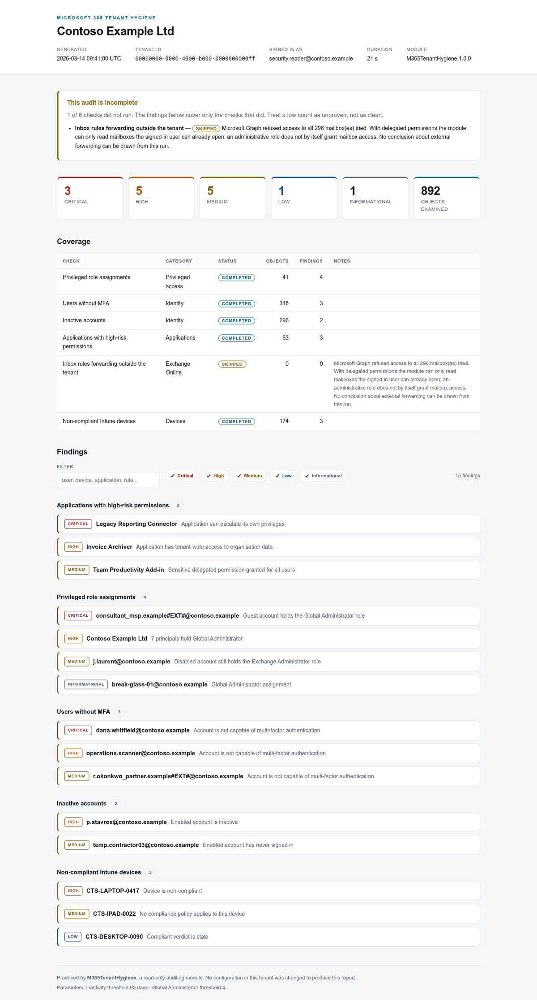
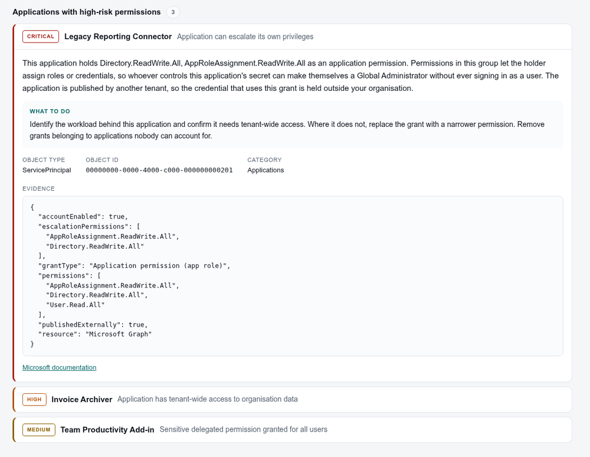
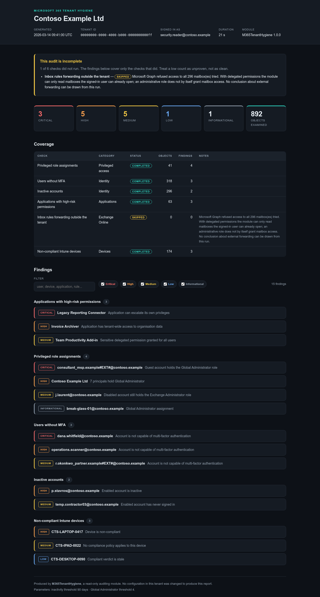

# m365-tenant-hygiene

A read-only PowerShell module that audits the security hygiene of a Microsoft 365
tenant over Microsoft Graph and produces a self-contained HTML report.

It answers the questions that get asked after an incident, before they get asked:
*who can sign in without MFA, who still has admin rights they no longer use, which
applications can read every mailbox in the tenant, and is anything quietly forwarding
mail outside the company.*

**It changes nothing.** There is no code path in this module that can write to a
tenant, and that is enforced by tests rather than promised in a sentence — see
[Read-only by construction](#read-only-by-construction).



---

## Contents

- [The problem](#the-problem)
- [What it checks](#what-it-checks)
- [Read-only by construction](#read-only-by-construction)
- [Requirements](#requirements)
- [Installation](#installation)
- [Setting up the app registration](#setting-up-the-app-registration)
- [Permissions requested, and why](#permissions-requested-and-why)
- [Usage](#usage)
- [The report](#the-report)
- [Limitations](#limitations)
- [How it is built](#how-it-is-built)
- [Development](#development)
- [Licence](#licence)

---

## The problem

Microsoft 365 tenants drift. Not dramatically — nobody decides to leave a former
administrator's account enabled with an Exchange Administrator role attached, or to
grant a reporting tool `Directory.ReadWrite.All` across the whole tenant. It happens
one reasonable decision at a time, and the result is only visible if somebody goes
looking across six different admin portals and correlates what they find.

The information is all available through Microsoft Graph. The work is in knowing
which endpoints to ask, how to grade what comes back, and — the part most scripts get
wrong — how to tell the difference between *"this tenant is fine"* and *"this script
could not see anything."*

That distinction is the design centre of this module. A check that lacks a permission,
a licence, or mailbox access reports **Skipped** with the reason attached, and the
report says so above the findings rather than below them. A low finding count on a
partial audit is not good news, and this tool refuses to let it look like good news.

## What it checks

| Check | What it finds | Why it matters |
|---|---|---|
| **Users without MFA** | Enabled accounts with no usable MFA method, separating *registered but unusable* from *never registered* | A single stolen password is enough. An administrator without MFA is graded Critical regardless of tenant size |
| **Inactive accounts** | Enabled accounts with no interactive sign-in inside the threshold (90 days by default), and accounts that have never signed in | Dormant accounts have old passwords and nobody watching them |
| **Privileged role assignments** | An inventory of tier-0 role holders, plus guests holding admin roles, service principals holding tier-0 roles, disabled accounts that still hold roles, and too many (or too few) Global Administrators | Admin roles accumulate; nobody removes them |
| **Applications with high-risk permissions** | Service principals holding permissions that allow self-escalation (`RoleManagement.ReadWrite.Directory`, `AppRoleAssignment.ReadWrite.All`, …) or tenant-wide data access (`Mail.ReadWrite`, `Files.ReadWrite.All`, …), plus tenant-wide delegated consent | Application permissions are not challenged by MFA, survive every password reset, and generate no sign-in notification |
| **External mail forwarding** | Inbox rules that forward or redirect outside the tenant's verified domains, flagging rules that also delete or mark as read | One of the oldest and most reliable signs of a compromised mailbox |
| **Non-compliant Intune devices** | Devices that are non-compliant, in grace period, unknown, or that **no compliance policy targets at all** | The last case is the interesting one: a device nothing evaluates never reports a failure |

Each check declares what it needs and what it cannot see:

```powershell
Get-M365HygieneCheck | Format-Table Id, Category, RequiredScopes
(Get-M365HygieneCheck -CheckId MailForwarding).Notes
```

## Read-only by construction

"Read-only" is easy to write in a README and easy to stop being true on the next commit.
Here it is a structural property with a test behind it:

- **One gateway.** Every Graph call in the module goes through
  `Invoke-HygieneGraphRequest`. That function has no `-Method` parameter and no `-Body`
  parameter, and the HTTP verb is hardcoded to `GET` at the only place a request is
  issued.
- **Only read scopes are ever requested.** Consent is derived from the checks you
  selected, so a single check consents to a single check's permissions.
- **Tests enforce it.** `tests/ReadOnly.Tests.ps1` fails the build if a second Graph
  call site appears, if the gateway grows a way to choose the verb, if any Graph write
  cmdlet or raw HTTP client shows up in the source, or if a requested scope is not a
  read scope.

Those tests were verified by deliberately breaking the module and confirming they go
red — a guard that has never failed proves nothing.

## Requirements

- **PowerShell 7.2 or later** (Windows, macOS or Linux)
- **Microsoft.Graph.Authentication 2.0.0 or later** — the only runtime dependency

The full `Microsoft.Graph` meta-module is deliberately *not* required. Every call goes
through `Invoke-MgGraphRequest`, so there is no reason to install dozens of generated
sub-modules.

Optional, for development only: `Pester` 5+ and `PSScriptAnalyzer`.

## Installation

Not on the PowerShell Gallery. Install from source:

```powershell
Install-Module Microsoft.Graph.Authentication -Scope CurrentUser

git clone https://github.com/earbona23/m365-tenant-hygiene.git
cd m365-tenant-hygiene
Import-Module ./src/M365TenantHygiene/M365TenantHygiene.psd1
```

To make it available in every session, copy `src/M365TenantHygiene` into a directory on
your `$env:PSModulePath`:

```powershell
$target = Join-Path ($env:PSModulePath -split [IO.Path]::PathSeparator)[0] 'M365TenantHygiene'
Copy-Item ./src/M365TenantHygiene $target -Recurse
```

## Setting up the app registration

The module authenticates as **you**, using delegated permissions. It never holds a
client secret or a certificate, so there is no long-lived credential to store, rotate
or leak. Everything it can see is bounded by what your own account can see.

You need an account that can grant admin consent (Global Administrator, Privileged Role
Administrator, or Cloud Application Administrator) **once**, at setup time.

### 1. Create the registration

1. Open the [Microsoft Entra admin center](https://entra.microsoft.com) →
   **Applications** → **App registrations** → **New registration**.
2. **Name:** `M365 Tenant Hygiene`
3. **Supported account types:** *Accounts in this organizational directory only
   (Single tenant)*.
4. **Redirect URI:** select **Public client/native (mobile & desktop)** and enter
   `http://localhost`.
5. **Register**.

> Public client is correct here. The module runs on a workstation and cannot keep a
> secret, so it uses the authorisation code flow with PKCE — the same model as the
> Azure CLI. A confidential client would mean storing a credential, which is the thing
> this design avoids.

### 2. Allow public client flows

**Authentication** → **Advanced settings** → **Allow public client flows** → **Yes** →
**Save**.

Required for `-UseDeviceCode`, which you will want on a server or over SSH.

### 3. Add the delegated permissions

**API permissions** → **Add a permission** → **Microsoft Graph** → **Delegated
permissions**, then add the permissions for the checks you intend to run:

| Permission | Needed for |
|---|---|
| `User.Read` | Always — reads the tenant name and verified domains |
| `AuditLog.Read.All` | Users without MFA; inactive accounts |
| `User.Read.All` | Inactive accounts; enumerating mailboxes to examine |
| `RoleManagement.Read.Directory` | Privileged role assignments |
| `Application.Read.All` | Applications with high-risk permissions |
| `Directory.Read.All` | Applications with high-risk permissions (delegated grants) |
| `MailboxSettings.Read` | External mail forwarding |
| `DeviceManagementManagedDevices.Read.All` | Non-compliant Intune devices |

Add only what you need. If you never run the Intune check, do not grant its permission.

### 4. Grant admin consent

**API permissions** → **Grant admin consent for \<tenant\>** → **Yes**.

All eight are admin-consent permissions; without this step sign-in fails with
`AADSTS65001`.

### 5. Give the auditing account a directory role

Delegated permissions are only half of the access decision. Microsoft Graph grants the
*intersection* of the app's consent and what the signed-in user is allowed to do, so
the account running the audit also needs a role that can read the data.

**[Global Reader](https://learn.microsoft.com/entra/identity/role-based-access-control/permissions-reference#global-reader)**
is the least-privileged role that covers the Entra-side checks. It is read-only by
definition, which fits this module exactly.

Narrower alternatives, if you prefer to combine them:

| Role | Covers |
|---|---|
| Reports Reader *or* Security Reader | MFA registration report |
| Directory Readers | Privileged role assignments; application grants |

For the Intune check, Intune applies its own role-based access control. If the device
check reports Skipped with an access error, assign the account an Intune role such as
**Read Only Operator**.

### 6. Copy the identifiers

From the app's **Overview** page, copy the **Application (client) ID** and the
**Directory (tenant) ID**. Neither is a secret.

```powershell
$clientId = '<application-client-id>'
$tenantId = '<directory-tenant-id>'
```

## Permissions requested, and why

Every permission below is the **least-privileged delegated permission** documented by
Microsoft for the endpoint that needs it, verified against the Microsoft Graph API
reference rather than copied from another script. Full endpoint-by-endpoint detail,
with links, is in [`docs/permissions.md`](docs/permissions.md).

| Scope | Endpoint | Why this one |
|---|---|---|
| `User.Read` | `GET /organization` | The module needs the tenant display name and verified domains — the latter is how the forwarding check decides what "external" means. `User.Read` is the lowest permission that returns those fields; `Organization.Read.All` would return more and require more consent for no benefit |
| `AuditLog.Read.All` | `GET /reports/authenticationMethods/userRegistrationDetails` | The only delegated permission this report accepts. There is no narrower option |
| `AuditLog.Read.All` | `GET /users?$select=signInActivity` | `signInActivity` is gated on this permission and on an Entra ID P1/P2 licence |
| `User.Read.All` | `GET /users` | Reads directory attributes for every user: enabled state, type, creation date, licences. Read-only; no `.ReadWrite` variant is requested |
| `RoleManagement.Read.Directory` | `GET /roleManagement/directory/roleAssignments`, `…/roleDefinitions` | Scoped to directory role management, unlike the broader `Directory.Read.All` that also satisfies this endpoint |
| `Application.Read.All` | `GET /servicePrincipals`, `…/appRoleAssignedTo` | Reads application identities and the app roles granted to them |
| `Directory.Read.All` | `GET /oauth2PermissionGrants` | Microsoft's least-privileged option for reading delegated grants; the alternative, `DelegatedPermissionGrant.ReadWrite.All`, is a *write* permission and is deliberately not used |
| `MailboxSettings.Read` | `GET /users/{id}/mailFolders/inbox/messageRules` | Reads inbox rules. It cannot read message content — this module never touches mail bodies |
| `DeviceManagementManagedDevices.Read.All` | `GET /deviceManagement/managedDevices` | Reads Intune device inventory and compliance state |

Not one `.ReadWrite` permission appears in that list, and the read-only test asserts it.

Check what was actually granted before running a long audit:

```powershell
Test-M365HygienePermission | Where-Object { -not $_.Satisfied }
```

## Usage

```powershell
Import-Module ./src/M365TenantHygiene/M365TenantHygiene.psd1

Connect-M365Hygiene -ClientId $clientId -TenantId $tenantId

$audit = Invoke-M365HygieneAudit
$audit.Summary

Export-M365HygieneReport -Audit $audit -Path ./reports
Disconnect-M365Hygiene
```

Run a subset — and consent to less:

```powershell
Connect-M365Hygiene -ClientId $clientId -TenantId $tenantId -CheckId MfaRegistration, PrivilegedRole
Invoke-M365HygieneAudit -CheckId MfaRegistration, PrivilegedRole | Export-M365HygieneReport -Path ./reports
```

On a headless host:

```powershell
Connect-M365Hygiene -ClientId $clientId -TenantId $tenantId -UseDeviceCode
```

Work with the findings directly:

```powershell
$audit.Findings | Where-Object Severity -in 'Critical', 'High' |
    Select-Object Severity, CheckName, ObjectName, Title

# What did not run, and why
$audit.Checks | Where-Object Status -ne 'Completed' | Select-Object CheckName, Status, Reason
```

Tune the thresholds:

```powershell
Invoke-M365HygieneAudit -InactiveDays 60 -GlobalAdminThreshold 3 -MaxMailbox 200
```

### Commands

| Command | Purpose |
|---|---|
| `Connect-M365Hygiene` | Sign in, requesting only the scopes the selected checks need |
| `Get-M365HygieneCheck` | List the checks, their scopes, their endpoints and their limits |
| `Test-M365HygienePermission` | Compare granted scopes against what each check requires |
| `Invoke-M365HygieneAudit` | Run the checks and return the audit result |
| `Export-M365HygieneReport` | Write the HTML report and the CSV exports |
| `Disconnect-M365Hygiene` | Sign out and clear the cached token |

Every command has full help: `Get-Help Invoke-M365HygieneAudit -Full`.

## The report

`Export-M365HygieneReport` writes three files:

| File | Contents |
|---|---|
| `*-report.html` | The readable report — one file, no external assets |
| `*-findings.csv` | One row per finding, for a spreadsheet or a ticket queue |
| `*-checks.csv` | One row per check, **including the ones that did not run and why** |

The coverage CSV exists because a findings spreadsheet on its own cannot tell a reader
that three checks never ran, and that is the fact most likely to be lost once the data
is pasted somewhere else.

The HTML report is genuinely self-contained: no CDN, no external stylesheet, no remote
fonts or images. It opens correctly from a USB stick, an air-gapped machine, or an
email attachment in six months' time. It renders in light and dark mode, filters by
severity and free text, and prints with every finding expanded.

**Coverage is stated before findings.** If any check was skipped, the report says so at
the top:



Each finding carries the evidence it was judged on, so a reader can disagree with the
tool without re-running the audit.

<details>
<summary>Dark mode</summary>


</details>

The screenshots above come from
[`samples/New-SampleReport.ps1`](samples/New-SampleReport.ps1), which renders a report
from synthetic data through the exact renderer used for real audits. The tenant,
users, devices and applications in it are invented; no real tenant data appears
anywhere in this repository. Reproduce it with:

```powershell
./samples/New-SampleReport.ps1 -Path ./out
```

## Limitations

The value of an audit tool is in knowing what it did *not* check. These are the real
boundaries, not a disclaimer.

**Mailbox coverage is the big one.** With delegated permissions, Microsoft Graph grants
the intersection of the app's consent and what the signed-in user can already do. Being
a Global Administrator does **not** by itself grant the right to open another person's
mailbox. In practice the forwarding check reaches your own mailbox plus any mailbox you
hold Full Access on, and Graph returns 403 for the rest. The check counts those refusals
and reports Skipped rather than clean, but the consequence stands: **on most tenants
this check covers a fraction of mailboxes.** Full coverage requires application
permissions, which is a different consent and credential model than the one this module
is built around.

**Inbox rules only.** Mailbox-level forwarding configured in Exchange
(`ForwardingSmtpAddress`) is not exposed by the Graph endpoint used here and is not
covered. Check it separately with Exchange Online PowerShell.

**`signInActivity` needs Microsoft Entra ID P1 or P2.** Without that licence Graph omits
the property entirely. Rather than reporting every account as dormant, the inactive
check detects the absence and reports Skipped.

**Intune needs a licence.** Without an active Intune subscription the device endpoint is
unavailable, and the check reports Skipped rather than "zero non-compliant devices".

**PIM eligible assignments are not counted.** Only *active* role assignments appear in
`roleAssignments`. An account that can elevate to Global Administrator but is not
currently elevated is invisible to this check. On a PIM-heavy tenant, the privileged
role figures understate who can reach tier 0.

**Role classification is by display name.** Built-in directory role names are stable,
and the alternative — a hardcoded table of template GUIDs — fails silently and
dangerously if one digit is wrong. Custom roles and roles outside the curated tier-0
and tier-1 lists are not classified, and roles assigned through a role-assignable group
are reported against the group without expanding its membership.

**Application permissions are checked on Microsoft Graph only.** That is one API call
rather than one per service principal, and it is where the highest-impact permissions
in a Microsoft 365 tenant live — but permissions granted on other resource APIs,
including the legacy Exchange Online API, are out of scope.

**MFA registration is not MFA enforcement.** This module reports who *could* complete a
challenge. Whether a challenge is ever issued depends on Conditional Access policies and
security defaults, which are not evaluated here. A tenant where every user is
MFA-capable can still let sign-ins through unchallenged.

**It is a point-in-time snapshot.** Recently created or revoked permission grants may
not appear immediately; Microsoft Entra is eventually consistent. Nothing here monitors
continuously or alerts.

**Severity is this tool's opinion.** The grading reflects blast radius as this module
models it. A break-glass account with no MFA is intentional in a well-run tenant and will
still be reported as Critical. Read the evidence, not just the colour.

**Not a compliance certification.** Passing every check here does not mean a tenant meets
CIS, NIST, ISO 27001 or any other benchmark. It means these six things were examined.

## How it is built

```
src/M365TenantHygiene/
├── M365TenantHygiene.psd1        Manifest
├── M365TenantHygiene.psm1        Loader; exports only Public/
├── Private/
│   ├── Invoke-HygieneGraphRequest.ps1   The read-only gateway: paging, throttling, GET only
│   ├── Get-HygieneCheckRegistry.ps1     The check catalogue that drives scopes and execution
│   ├── New-HygieneAuditContext.ps1      Shared cache, tenant identity, external-address test
│   ├── New-HygieneFinding.ps1           The finding shape
│   ├── New-HygieneCheckResult.ps1       Completed / Skipped / Failed
│   ├── ConvertTo-HygieneHtmlReport.ps1  HTML renderer with escaping
│   ├── Get-HygieneReportAsset.ps1       Inlined CSS and JS
│   └── Write-HygieneLog.ps1
├── Checks/                       One file per check
└── Public/                       The six exported commands
```

Three decisions worth calling out:

**The registry drives consent.** Scopes are derived from the checks you selected, not
filtered from a fixed block. Fewer checks really does mean less consent.

**Checks share a cache, and their order is meaningful.** `PrivilegedRole` runs first and
records which principals hold admin roles; `InactiveAccount` uses that to raise the
severity of a dormant administrator. A check that consumes another's cache degrades
gracefully when that check was not selected — it loses the enrichment, never the
correctness.

**Absent data is not clean data.** Every check that depends on a licence, a permission
or an access grant detects the absence explicitly and reports Skipped with a reason.
That behaviour is covered by tests, because it is the one bug in an audit tool that is
invisible in production: it looks like good news.

## Development

```powershell
Install-Module Pester, PSScriptAnalyzer -Scope CurrentUser

Invoke-Pester ./tests -Output Detailed
Invoke-ScriptAnalyzer -Path ./src -Recurse -Settings ./PSScriptAnalyzerSettings.psd1
```

72 tests across five files. The Graph gateway is mocked, so every check's logic runs for
real against simulated responses — including the paths where a check must refuse to draw
a conclusion.

Both run in CI on every push and pull request.

## Licence

[MIT](LICENSE).

This module is provided as-is. Run it against a tenant you are authorised to audit.
